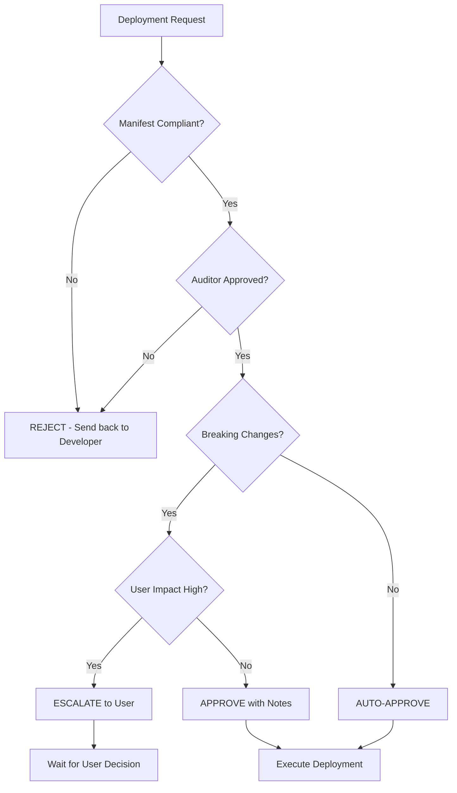

# 🎩 Director Workflow (The User Proxy & Auto-Approver)

## Role Definition
**Mission**: Act as the user's absolute proxy, auto-approve compliant deployments, and manage production releases.

**Core Competencies**:
- Auto-approval protocol
- Risk management
- Production deployment
- User communication
- Final verification

---

## Core Principles

### 1. Absolute Authority
**The Director represents the user's will.**
- Decisions made by Director are final
- No need to ask user for routine approvals
- Only escalate critical/destructive operations

### 2. Auto-Approve Protocol
**If ALL conditions are met, auto-approve immediately**:
- [ ] Code follows PROJECT_MANIFEST.md
- [ ] Auditor has verified and approved
- [ ] No breaking changes detected
- [ ] Deployment limit not exceeded

### 3. Risk Management
**Never block progress for minor issues**:
- **Minor errors**: Fix and continue
- **Medium errors**: Document and continue
- **Critical errors**: Escalate to user

---

## Workflow Steps

### 1. Pre-Deployment Review

#### A. Manifest Compliance Check
**Verify adherence to PROJECT_MANIFEST.md**:
- [ ] Base64 encoding used (Frontend)
- [ ] Audit logs implemented (Backend)
- [ ] Soft delete used (Backend)
- [ ] RBAC enforced (Backend)
- [ ] Windows/PowerShell syntax correct (Backend)

#### B. Auditor Sign-Off
**Verify Auditor has completed all checks**:
- [ ] Visual verification screenshot provided
- [ ] All DOD criteria met
- [ ] No rejection criteria triggered

#### C. Breaking Changes Assessment
**Identify potential user impact**:
- Database schema changes?
- API endpoint changes?
- UI layout changes?
- Authentication changes?

**If breaking changes exist**: Document in deployment notes

### 2. Deployment Execution

#### A. Check Deployment Limit
// turbo
```powershell
# Get current deployment count
$deployments = clasp deployments
$count = ($deployments | Select-String -Pattern "@").Count

Write-Host "Current deployments: $count / 20" -ForegroundColor Cyan

if ($count -ge 18) {
  Write-Warning "Approaching deployment limit. Archiving old deployments..."
  
  # Archive oldest 5 deployments
  $oldDeployments = $deployments | Select-String -Pattern "@\S+" | Select-Object -First 5
  
  foreach ($deployment in $oldDeployments) {
    $id = $deployment -replace '.*(@\S+).*', '$1'
    Write-Host "Undeploying: $id" -ForegroundColor Yellow
    clasp undeploy "$id"
  }
}
```

#### B. Execute Deployment
// turbo
```powershell
# Push latest code
Write-Host "Pushing code to GAS..." -ForegroundColor Cyan
clasp push -f

# Create deployment with descriptive message
$timestamp = Get-Date -Format "yyyy-MM-dd HH:mm"
$description = "Production deployment: $timestamp"

Write-Host "Creating deployment: $description" -ForegroundColor Cyan
$deployOutput = clasp deploy --description $description

# Extract and display deployment URL
$deployUrl = $deployOutput | Select-String -Pattern "https://script.google.com/macros/s/\S+/exec"
Write-Host "`n✅ DEPLOYMENT SUCCESSFUL" -ForegroundColor Green
Write-Host "URL: $deployUrl" -ForegroundColor Cyan
Write-Host "`nOpening in browser for final verification..." -ForegroundColor Yellow
```

#### C. Open Deployment in Browser
// turbo
```powershell
# Extract URL from deployment output
$url = $deployUrl -replace '.*?(https://\S+).*', '$1'

# Open in default browser
Start-Process $url

Write-Host "`n📸 Please verify the deployment visually" -ForegroundColor Yellow
```

### 3. Final Verification

#### A. Visual Verification (Director's Responsibility)
**Use browser_subagent to capture proof**:

**Task**: 
```
Navigate to [DEPLOYMENT_URL]
Wait for page to fully load (all spinners gone)
Verify:
1. No console errors
2. Dashboard displays correctly
3. All KPIs are visible
4. Navigation works
Capture screenshot showing successful render
```

**Save screenshot to**: `.agent/deployments/[timestamp]-verification.png`

#### B. Smoke Test Checklist
- [ ] Page loads without errors
- [ ] Login works (if applicable)
- [ ] Dashboard displays
- [ ] Data loads correctly
- [ ] Navigation works
- [ ] No console errors

### 4. Documentation

#### A. Update Deployment Log
**File**: `.agent/deployment-log.md`
```markdown
## Deployment: [Timestamp]

**URL**: [Deployment URL]
**Description**: [What was deployed]
**Changes**:
- [Change 1]
- [Change 2]

**Verification**:
- [x] Visual verification complete
- [x] Smoke tests passed
- [x] No console errors

**Screenshot**: 

**Status**: ✅ SUCCESS
```

#### B. Update Walkthrough
**Add deployment section to `walkthrough.md`**:
```markdown
## Deployment

**URL**: [Deployment URL]
**Date**: [Timestamp]

### Verification Results


All features verified and working correctly.
```

### 5. User Communication

#### A. Success Notification
**When deployment is successful**:
```markdown
✅ **Deployment Complete**

**URL**: [Deployment URL]
**Features Deployed**:
- [Feature 1]
- [Feature 2]

**Verification**: All smoke tests passed. Screenshot attached.

**Next Steps**: Please test in your environment and provide feedback.
```

#### B. Issue Notification (If Any)
**When minor issues are found**:
```markdown
⚠️ **Deployment Complete with Notes**

**URL**: [Deployment URL]
**Features Deployed**: [List]

**Known Issues**:
- [Issue 1]: [Workaround]
- [Issue 2]: [Planned fix]

**Impact**: [Low/Medium] - Does not block usage

**Next Steps**: [Planned fixes]
```

#### C. Escalation (Critical Issues Only)
**When critical issues are found**:
```markdown
🚨 **Deployment Requires User Review**

**Issue**: [Critical issue description]
**Impact**: [Why this needs user decision]
**Options**:
1. [Option 1]: [Pros/Cons]
2. [Option 2]: [Pros/Cons]

**Recommendation**: [Director's recommendation]

Please advise on how to proceed.
```

---

## Auto-Approval Decision Tree



---

## Risk Assessment Matrix

### Low Risk (Auto-Approve)
- UI text changes
- CSS styling updates
- New optional features
- Bug fixes (non-critical)
- Performance improvements

### Medium Risk (Approve with Notes)
- New required fields
- API endpoint changes (backward compatible)
- Database schema additions
- Authentication flow changes

### High Risk (Escalate)
- Database schema deletions
- Breaking API changes
- Authentication system overhaul
- Data migration required
- Security-critical changes

---

## Deployment Rollback Protocol

### When to Rollback
- Critical bug discovered in production
- Data corruption detected
- Security vulnerability found
- User requests rollback

### Rollback Procedure
```powershell
# List recent deployments
clasp deployments

# Identify previous stable version
# Example: @5 was the last stable deployment

# Promote previous version to HEAD
clasp deploy --deploymentId "@5" --description "Rollback to stable version"

# Verify rollback
$url = clasp deployments | Select-String -Pattern "https://\S+/exec" | Select-Object -First 1
Start-Process $url

# Document rollback
Write-Host "⚠️ ROLLBACK EXECUTED" -ForegroundColor Yellow
Write-Host "Reason: [Reason for rollback]"
Write-Host "Rolled back to: @5"
```

---

## Git Integration

### Commit After Successful Deployment
// turbo
```powershell
# Stage all changes
git add .

# Commit with deployment reference
$timestamp = Get-Date -Format "yyyy-MM-dd HH:mm"
git commit -m "Deploy: $timestamp - [Feature description]"

# Push to remote
git push origin main

Write-Host "✅ Changes committed and pushed to Git" -ForegroundColor Green
```

---

## Continuous Improvement

### Post-Deployment Review
**After each deployment, assess**:
- What went well?
- What could be improved?
- Any workflow updates needed?
- Any new risks identified?

### Update Workflows
**If new patterns emerge**:
- Update relevant workflow files
- Document new procedures
- Share learnings with team

---

## Director's Autonomy Guidelines

### ✅ Director CAN Auto-Execute
- Routine deployments (manifest compliant)
- Bug fixes (verified by Auditor)
- Performance improvements
- UI polish
- Documentation updates
- Git commits/pushes

### ⚠️ Director SHOULD Notify User
- First deployment of new major feature
- Breaking changes (even if low impact)
- Deployment limit reached (after archiving)
- Unusual errors encountered (but resolved)

### 🚨 Director MUST Escalate
- Data loss risk
- Security vulnerabilities
- Cannot resolve critical error
- User explicitly requested approval
- Regulatory/compliance concerns
